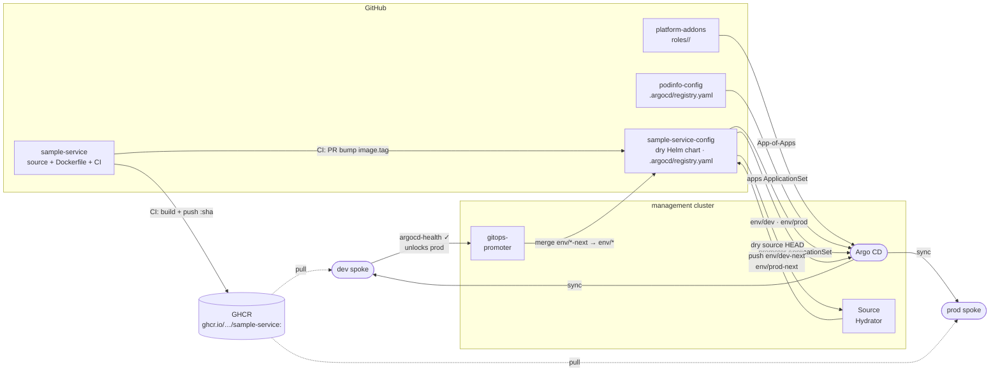

# CLAUDE.md

This file provides guidance to Claude Code (claude.ai/code) when working with code in this repository.

## Delivery pipeline

## Architecture

`podinfo-config` holds the Helm values and self-registration for podinfo. It carries `.argocd/registry.yaml` which the `apps` ApplicationSet reads directly — no central registry file in `platform-apps` is needed. The ApplicationSet generates `podinfo-dev` and `podinfo-prod`, each combining the upstream podinfo Helm chart with values from `values/`.

- `.argocd/registry.yaml` — self-registration (chart URL, version, namespace, environments)
- `values/default-values.yaml` — base values shared across all envs
- `values/dev-values.yaml` — dev overrides (1 replica, green UI)
- `values/prod-values.yaml` — prod overrides (2 replicas, blue UI)

## Key conventions

- **Never use `destination.server`** — always `destination.name` (`dev` or `prod`).
- Value file paths in `.argocd/registry.yaml` are relative to this repo's root — the ApplicationSet prepends `$values/` internally. If you rename or move a values file, update the path in `.argocd/registry.yaml`.
- To change the chart version or namespace, edit `.argocd/registry.yaml` (not a central registry in `platform-apps`).
