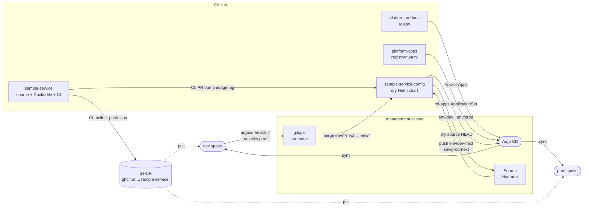

# CLAUDE.md

This file provides guidance to Claude Code (claude.ai/code) when working with code in this repository.

## Delivery pipeline

## Architecture

`podinfo-config` holds the Helm values for podinfo. It is the `$values` source referenced by `platform-apps/registry/podinfo.yaml` — the `cd-apps` ApplicationSet reads that registry entry and generates `podinfo-dev` and `podinfo-prod` Argo CD Applications, each combining the upstream podinfo Helm chart with values from this repo.

- `values/default-values.yaml` — base values shared across all envs
- `values/dev-values.yaml` — dev overrides (1 replica, green UI)
- `values/prod-values.yaml` — prod overrides (2 replicas, blue UI)

## Key conventions

- **Never use `destination.server`** — always `destination.name` (`dev` or `prod`).
- Value file paths are referenced from `platform-apps/registry/podinfo.yaml` as `$values/values/<file>` — if you rename or move files, update that registry entry too.
