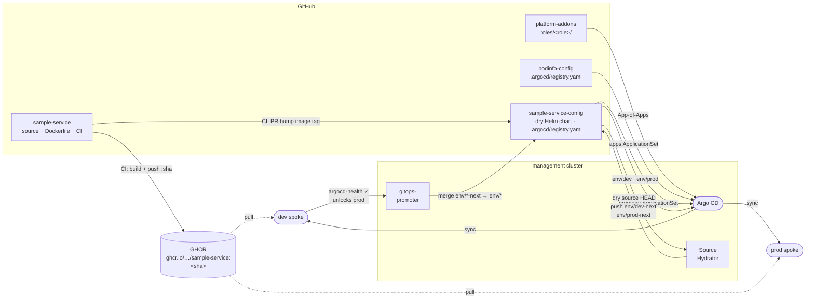

# podinfo-config

Helm values and self-registration for [podinfo](https://github.com/stefanprodan/podinfo), delivered to dev and prod spokes via the `apps` ApplicationSet in [platform-control-plane](https://github.com/platform-engineer-lab/platform-control-plane).

## How it fits in

This repo self-registers by shipping `.argocd/registry.yaml`. The `apps` ApplicationSet reads that file and generates `podinfo-dev` and `podinfo-prod` — each combining the upstream podinfo Helm chart with values from this repo's `values/` directory.

To change podinfo configuration, edit the values files here and push — Argo CD picks up the change on next sync. To change the chart version or namespace, update `.argocd/registry.yaml`.

## Repository layout

```
.argocd/
  registry.yaml             self-registration — read by the apps ApplicationSet

values/
  default-values.yaml       base Helm values shared across all envs
  dev-values.yaml           dev overrides (1 replica, green UI)
  prod-values.yaml          prod overrides (2 replicas, blue UI)
```

## `.argocd/registry.yaml`

```yaml
name: podinfo
repoUrl: https://stefanprodan.github.io/podinfo
chart: podinfo
chartVersion: 6.14.0
namespace: podinfo
valuesRepoURL: https://github.com/platform-engineer-lab/podinfo-config
environment:
  - env: dev
    defaultValuesFile: values/default-values.yaml
    valuesFile: values/dev-values.yaml
  - env: prod
    defaultValuesFile: values/default-values.yaml
    valuesFile: values/prod-values.yaml
```

The `apps` ApplicationSet prepends `$values/` to `defaultValuesFile` and `valuesFile` paths internally — the paths in `registry.yaml` are relative to this repo's root.

## Delivery pipeline


