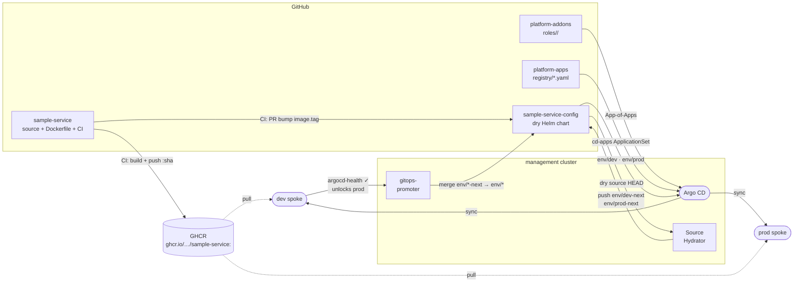

# podinfo-config

Helm values for [podinfo](https://github.com/stefanprodan/podinfo), delivered to dev and prod spokes via the `cd-apps` ApplicationSet in [platform-control-plane](https://github.com/platform-engineer-lab/platform-control-plane).

## Delivery pipeline



## Repository layout

```
values/
  default-values.yaml   base Helm values shared across all envs
  dev-values.yaml       dev-specific overrides (1 replica, green UI)
  prod-values.yaml      prod-specific overrides (2 replicas, blue UI)
```

## How it fits in

`platform-apps/registry/podinfo.yaml` registers podinfo with the `cd-apps` ApplicationSet and points `$values` at this repo. The ApplicationSet generates `podinfo-dev` and `podinfo-prod` Argo CD Applications — each a multi-source Helm release combining the upstream podinfo chart with values from this repo.

To change podinfo configuration, edit the values files here and push — Argo CD picks up the change on next sync.
